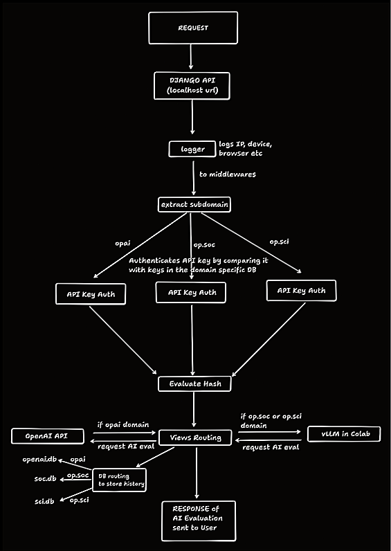

# Django AI API

A Django-based AI evaluation API that demonstrates advanced middleware implementation with secure API access, request integrity validation, and dynamic subdomain routing.

## Project Overview

This project explores building custom Django middleware to create a secure AI API with the following key features:

- **API Key Authentication**: Custom middleware for API key-based user access control
- **Request Integrity Validation**: Hash-based message tampering detection using SHA256
- **Dynamic Subdomain Routing**: Automatic view and database routing based on subdomains
- **AI Model Integration**: Multiple AI models accessible through different subdomains
- **Interactive Testing Interface**: Streamlit application for API testing and interaction

## Sample Images
<div align="center">

| Screenshot 1 | Screenshot 2 | Screenshot 3 |
|:---:|:---:|:---:|
|  |  |  |

| Screenshot 4 | Screenshot 5 |
|:---:|:---:|
|  |  |

</div>

## Architecture

## Key Components

### Custom Middleware
- **LoggingMiddleware**: Logs user IP addresses, devices, and browser information. Django based logs are stored in django.log file and middleware logs are stored in middleware.log file
- **APIKeyAuthMiddleware**: Validates API keys for secure access
- **HashedMiddleware**: Checks request integrity using SHA256 hashes
- **SubdomainMiddleware**: Routes requests based on subdomain patterns

### API Endpoints
- **AI Generation**: `/ai/generate` - Generate AI responses for academic evaluation
- **Model Information**: `/ai/info` - Get AI model details and capabilities
- **History**: `/history/` - Retrieve user's API interaction history

### Subdomain Routing
- `opai.localhost` - OpenAI GPT-4.1 Mini model
- `op.soc.localhost` - Social Science Fine-Tuned Llama-3-8B model  
- `op.sci.localhost` - Science Llama Fine-Tuned Llama-3-8B model

### Streamlit Interface
A user-friendly web application (`inference.py`) that provides:
- Model selection and configuration
- Structured input forms for academic evaluation
- Real-time API testing and response visualization
- Request history browsing

## Configuration

### Environment Variables
Create a `.env` file in the project root with the following required variables:

```
OPENAI_API_KEY=your_openai_api_key_here
OPENAI_MODEL_ID=your_openai_model_id_here
```

These environment variables are essential for the OpenAI model integration to function properly.

### vLLM Inference Setup
This project uses vLLM for running fine-tuned Llama models. The inference setup is based on the repository: [Finetuning_with_scraps](https://github.com/Vjay15/Finetuning_with_scraps)

#### Setup Steps:
1. **Run the vLLM server** from the Finetuning_with_scraps repository
2. **Obtain the cloudflared tunnel link** from the notebook output
3. **Update the API endpoint** in `views.py` file with the new tunnel URL

#### Important:
- The Social Science and Science Llama models require the vLLM server to be running
- Update the inference URLs in `api_proj/views.py` whenever you get a new cloudflared tunnel link
- The tunnel link changes each time you restart the vLLM server

## Security Features

- **Hash Validation**: Ensures requests haven't been tampered with during transmission
- **API Key Management**: Secure authentication for different AI models
- **Request Logging**: Comprehensive logging of user activities and system access

This project serves as an educational example of implementing robust middleware patterns in Django while building a practical AI evaluation system.
